<style>
img[alt=m] {
    max-width: 350px;
}
img[alt=b] {
    max-width: 500px;
}

</style>
# iBaye

步步高电子词典经典游戏 -- 三国霸业 多平台移植版本

目前已支持的平台：iOS/macOS/Windows/HTML5/微信小游戏

交流QQ群：526266208

## 开发环境配置

1. 安装emscripten

    Ubuntu

	```
    sudo apt install emscripten
	```

	或参考[官方文档](http://kripken.github.io/emscripten-site/docs/getting_started/downloads.html#platform-notes-installation-instructions-portable-sdk),
	或直接下载配置好开发环境的虚拟机：[百度云下载](https://pan.baidu.com/s/1eRFehjW)


2. 下载霸业源码，编译生成baye.js

```
    git clone https://git.oschina.net/bgwp/iBaye.git
    cd iBaye/js
    emconfigure cmake ../src
    make
```

## 游戏截图

### iOS原生版
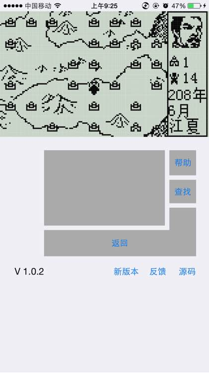

---
### 微信小游戏端
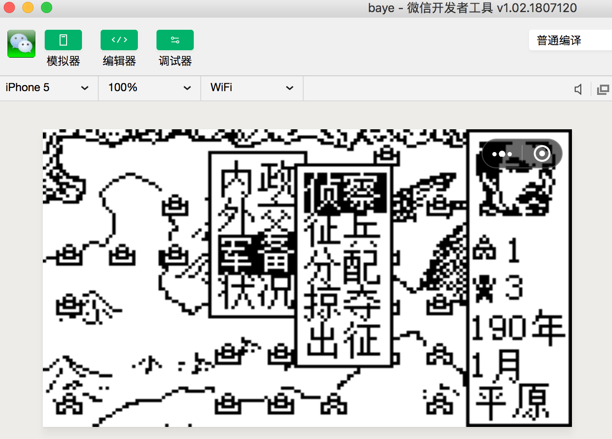

---

### HTML5 - PC端


---

### HTML5 - Mobile端
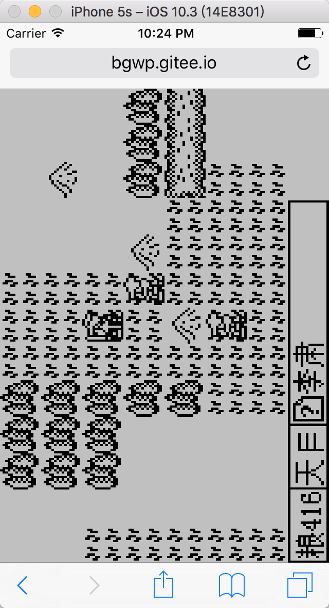

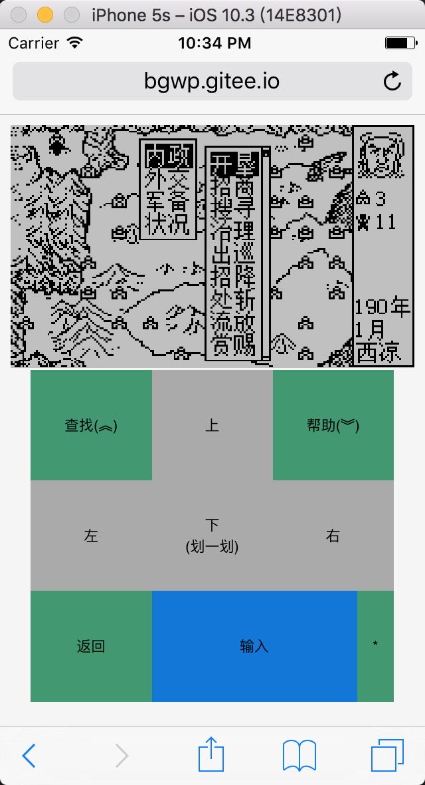

单手键盘：

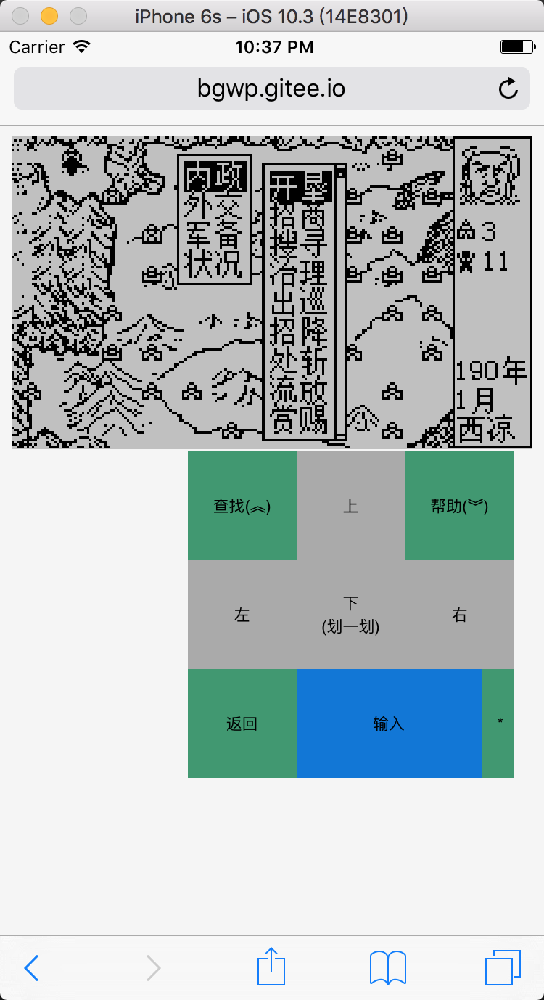
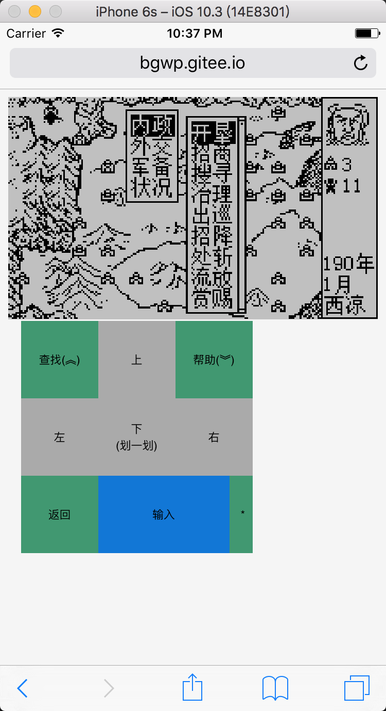

---

### Windows版
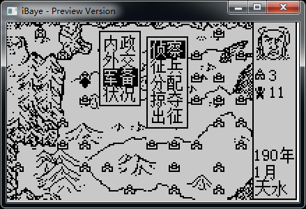

---

### macOS版
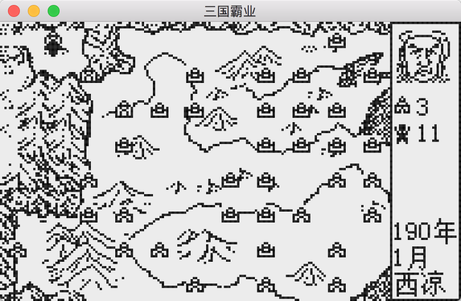

---

### 支持高度定制mod，有丰富的修改mod

即使是农民，也能高度自由定制修改版本。

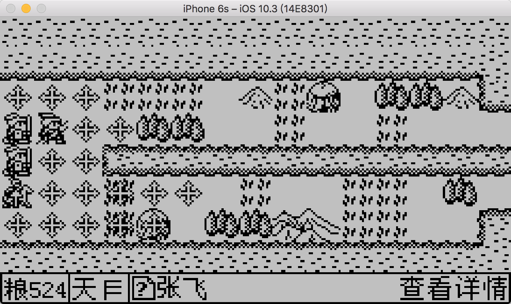
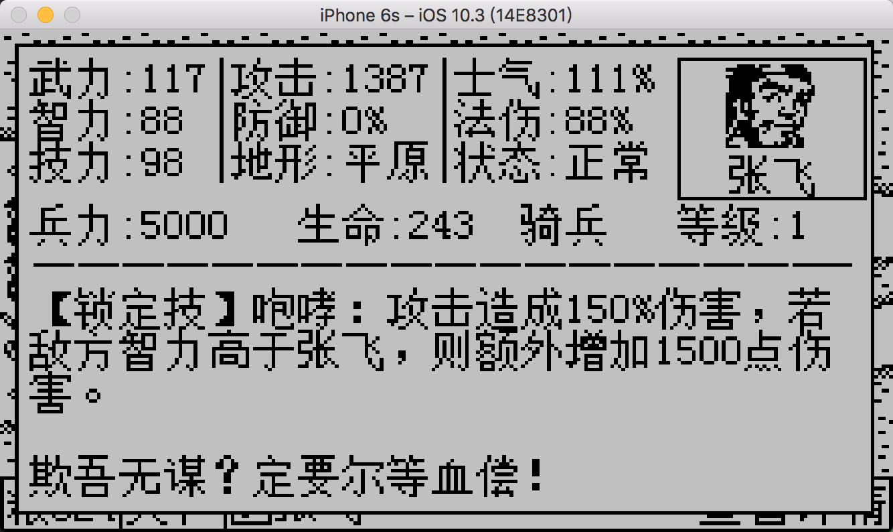
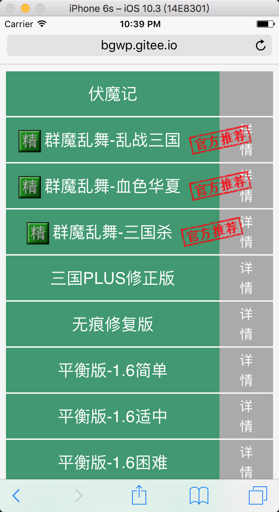
